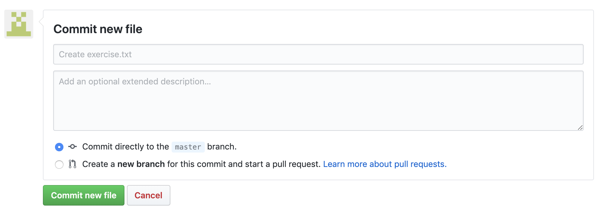

## Assignment One: Introduction to the Command Line Interface (CLI)

In this assignment you will watch a video lesson introducing you to the command line. If you strip back all of the graphics
you currrently see on your computer screen right now and just take the text, you would have the command line. Instead
of using your trackpad or mouse to navigate your computer you instead use text based commands. We are learning how to use 
the command line because a majority of our first programs will be run on the command line. 

For this lesson you will first watch a video lecture and from that lesson complete an exercise.

:tv: Watch [Lesson One CLI](https://drive.google.com/open?id=1xFb5nzBWTI9CvDSqK0dHxQx-XtyBASBz)

:notebook: Exercise

In this exercise I would like you to explain how you could make a directory that looks like the following (Note: `hello.txt` is in the `FolderOne` directory:

Your explanation should include the commands you would use to replicate the directory on your computer. I would recommend
trying to make a similar dirrectory on your computer before writing your explanation.

You will submit your explanatation by creating a new file on GitHub :octocat: named `exercise.txt`. In order to create a new file click on the button that says `Create new file`:

Once you have clicked the `Create new file` button you can name your file `exercise.txt` here:

After naming the file you can go ahead and type your response.

When you are done typing your response, scroll to the bottom of the page and press the button that says `Commit new file`:

Once you have pressed the button you are done! :tada:
